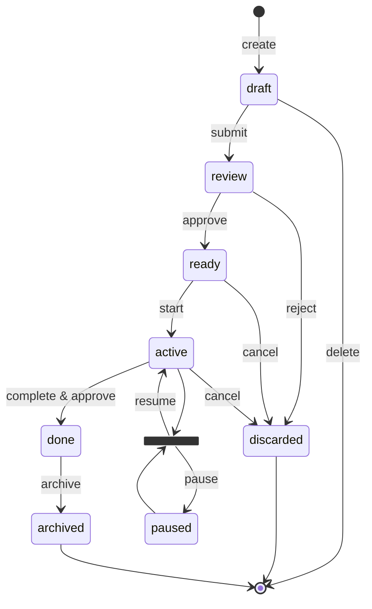

<!--
  Copyright 2025-2026 GitGovernance (https://www.gitgovernance.com)
  SPDX-License-Identifier: Apache-2.0

  Licensed under the Apache License, Version 2.0 (the "License");
  you may not use this file except in compliance with the License.
  You may obtain a copy of the License at

      http://www.apache.org/licenses/LICENSE-2.0

  Unless required by applicable law or agreed to in writing, software
  distributed under the License is distributed on an "AS IS" BASIS,
  WITHOUT WARRANTIES OR CONDITIONS OF ANY KIND, either express or implied.
  See the License for the specific language governing permissions and
  limitations under the License.

  Part of the GitGovernance Protocol — designed and maintained by GitGovernance.
-->

# RFC-04: Task Record

> Version: 1.1 | Status: Stable\
> Created: May 2025 | Last updated: 2026-02-04\
> Schema: `schemas/task_record_schema.yaml`

## Abstract

The Task Record is the **atomic unit of work** within the GitGovernance Protocol. It defines *what* must be done, while separating *who does it* (assignment via FeedbackRecord) and *how it was done* (execution via ExecutionRecord). Unlike traditional ticketing systems, a TaskRecord is a cryptographically signed, immutable record wrapped in an Embedded Metadata envelope (RFC-01). The Task lifecycle follows a state machine with 8 canonical states, governed by signed events rather than manual edits.

---

## 1. Motivation

In hybrid human-AI teams, task management must go beyond simple state tracking. Traditional systems conflate the work definition, the worker assignment, and the execution history into a single mutable object — making auditability impossible.

GitGovernance solves this with three principles:

- **The Task is atomic.** It defines the *promise of work*, not its decomposition. The "how" lives in ExecutionRecords. Dependencies between tasks are modeled as references, not parent-child hierarchies.
- **Assignment is a conversation, not a field.** Responsibility is recorded as a signed FeedbackRecord, preserving a full audit trail of handovers.
- **State transitions are signed events.** Moving a task from `review` to `ready` requires a cryptographic signature from an authorized actor. The event history is reconstructed from the chain of signatures and linked records.

---

## 2. Terminology

| Term | Definition |
|:-----|:-----------|
| **Task Record** | A signed, immutable record representing an atomic unit of work. |
| **Task ID** | A unique identifier following the pattern `{timestamp}-task-{slug}`. |
| **Canonical State** | One of the 8 states in the task lifecycle state machine. |
| **Typed Reference** | A link in the `references` array using a recognized prefix (e.g. `task:`, `file:`, `commit:`). |
| **Assignment** | A temporal agreement recorded via a FeedbackRecord with `type: "assignment"`. |

---

## 3. Task ID Structure

### 3.1. ID Format

Every Task MUST have a globally unique identifier following the pattern:

```
{timestamp}-task-{slug}
```

- **`timestamp`**: Unix epoch seconds (integer, 10 digits) at the time of record creation. Derived from the author's signature timestamp.
- **`slug`**: A URL-friendly string derived from the title, matching `[a-z0-9-]{1,50}`.

**Pattern**: `^\d{10}-task-[a-z0-9-]{1,50}$`
**Max Length**: 66 characters (10 timestamp + 1 dash + 4 "task" + 1 dash + 50 slug)

### 3.2. ID Generation Algorithm

```
FUNCTION generateTaskId(title, timestamp = now()):
  slug = title
    |> lowercase
    |> take_first(50)
    |> replace(/[^a-z0-9]+/g, '-')
    |> trim('-')
  RETURN "{timestamp}-task-{slug}"

EXAMPLES:
  "Fix OAuth bug!!" → "1752274500-task-fix-oauth-bug"
  "Implement AI model" → "1752274500-task-implement-ai-model"
```

*Rationale: Timestamps provide inherent chronological sorting and collision resistance without requiring centralized counters.*

---

## 4. Record Schema

The Task Record is the `payload` inside an Embedded Metadata envelope (RFC-01) where `header.type` is `"task"`. The schema is defined in `task_record_schema.yaml`.

### 4.1. Mandatory Fields

| Field | Type | Constraint | Description |
|:------|:-----|:-----------|:------------|
| `id` | string | `^\d{10}-task-[a-z0-9-]{1,50}$`, maxLength: 66 | Unique identifier (§3). |
| `title` | string | minLength: 3, maxLength: 150 | Brief, human-readable summary. Used to generate the ID slug. |
| `status` | enum | `draft` \| `review` \| `ready` \| `active` \| `done` \| `archived` \| `paused` \| `discarded` | Current lifecycle state (§5). |
| `priority` | enum | `low` \| `medium` \| `high` \| `critical` | Strategic or tactical priority level. |
| `description` | string | minLength: 10 | Functional, technical, or strategic summary of the objective. |

### 4.2. Optional Fields

| Field | Type | Constraint | Default | Description |
|:------|:-----|:-----------|:--------|:------------|
| `cycleIds` | array of strings | items: `^\d{10}-cycle-[a-z0-9-]{1,50}$`, maxLength: 67 | `[]` | IDs of the strategic Cycles this task belongs to. |
| `tags` | array of strings | items: `^[a-z0-9-]+(:[a-z0-9-]+)*$`, minLength: 1 | `[]` | `key:value` tags for categorization (e.g. `skill:react`, `category:bug`). |
| `references` | array of strings | items: minLength: 1, maxLength: 500 | `[]` | Typed links to related resources (§7). |
| `notes` | string | minLength: 1 | — | Additional context, decisions, or clarifications. |
| `metadata` | object | additionalProperties: true | — | Structured data for programmatic consumption (see §4.3). |

### 4.3. Metadata

| Property | Value |
|----------|-------|
| **Field** | `metadata` |
| **Type** | `object` |
| **Required** | No |
| **additionalProperties** | `true` |

An optional field for structured, machine-readable data. While `tags` provide flat classification and `notes` provide free-form human text, `metadata` carries structured data intended for programmatic consumption by products, workflows, or external tools.

**Semantics:** The protocol does not prescribe any keys or structure within `metadata`. Its contents are domain-specific and opaque to the protocol layer. Implementations SHOULD preserve metadata faithfully across read/write cycles.

**Common use cases:**
- **Epic modeling:** `{ "epic": true, "phase": "active", "files": {...} }`
- **External tool integration:** `{ "jira": "PROJ-123", "linearId": "LIN-456" }`
- **Agent metrics:** `{ "estimatedHours": 4, "model": "claude-opus-4-6" }`
- **Compliance tagging:** `{ "regulation": "SOC2", "controlId": "CC6.1" }`

No additional properties are allowed at the root level.

---

## 5. The State Machine

### 5.1. The 8 Canonical States

The Task lifecycle is governed by a state machine with **6 primary states** (the "happy path") and **2 exceptional states** (`paused` and `discarded`).



### 5.2. State Descriptions

| State | Meaning | Transition Event |
|:------|:--------|:-----------------|
| `draft` | The idea exists. | Creation by an author. |
| `review` | The proposal is under scrutiny. | `submit` — signed by the author. |
| `ready` | Validated intent; queued for execution. | Approved via gates defined in the active Workflow (RFC-08). |
| `active` | Work in progress. | Linked to the first ExecutionRecord (signed by executor). |
| `done` | Work completed and validated. | Final approver signature. |
| `archived` | Historical record; lifecycle closed. | Explicit archive command with appropriate signature. |

### 5.3. Exceptional States

| State | Meaning | Entry Condition | Exit Condition |
|:------|:--------|:----------------|:---------------|
| `paused` | Blocked by an external dependency. | Explicit justification via a `blocker` ExecutionRecord or FeedbackRecord. | `resume` — the blocking condition is resolved. |
| `discarded` | Cancelled or rejected. Terminal state. | `reject` (from `review`) or `cancel` (from `ready` or `active`), with a signed reason. | None — terminal state. |

These states are outside the primary flow. A task blocks (`active` → `paused`) only via explicit, documented justification.

---

## 6. Governance Protocols

### 6.1. Assignment (No `assignee` Field)

A TaskRecord defines **work**, not **workers**. Assignment is a temporal agreement recorded in a separate FeedbackRecord with `type: "assignment"`.

**Why this model is superior to a simple `assignee` field:**

- **Full traceability.** Each assignment and reassignment is a signed, timestamped event — creating an immutable ledger of responsibility. A simple `assignee` field would lose the history of who was responsible and when.
- **Decoupling.** The TaskRecord stays focused on the promise of work, while the FeedbackRecord manages execution logistics.
- **Explicit governance.** Assignment becomes a formal ceremony — an auditable act of communication rather than a metadata edit.

### 6.2. Transition Gates (Workflow-Defined)

State transitions — such as `review` → `ready` — may require gates (signature gates, event gates, custom rules) as defined in the active Workflow (RFC-08). The Task protocol does not mandate specific gate configurations; it provides the record structure and state machine, while the Workflow defines the governance rules.

For example, a Workflow might require an `auditor` signature to approve a task, with a quality evaluation recorded in the signature's `notes` field. The specific dimensions, thresholds, and scoring criteria are Workflow configuration, not protocol constraints.

*Rationale: Separating the record (Task) from its governance rules (Workflow) keeps the protocol agnostic to specific organizational policies. Different teams can enforce different approval processes over the same record structure.*

### 6.3. Field Modification Traceability

All fields in a TaskRecord — including `description`, `priority`, and `status` — are protected by the Embedded Metadata envelope (RFC-01). Any modification to any field produces a new `payloadChecksum`, which requires a new signature. The previous version is preserved in Git history.

This means every change to a TaskRecord is:
- **Detectable**: The checksum changes.
- **Attributable**: A new signature with `keyId`, `role`, `timestamp`, and `notes` is required.
- **Traceable**: Git history preserves all prior versions.

The Workflow (RFC-08) may define additional custom rules restricting which fields can be modified in which states (e.g., preventing description changes during `active` state). Such rules are governance policy, not protocol constraints.

### 6.4. Deletion Semantics

The protocol distinguishes between **deletion** and **discarding**:

- **Draft deletion**: Tasks in `draft` state can be **completely deleted** (hard delete from the file system) without leaving a `discarded` record, since they never entered the formal governance flow.
- **Post-draft discarding**: Tasks that have passed `draft` (i.e. in `review`, `ready`, or `active`) MUST transition to `discarded` with a signed reason. Hard deletion is not permitted — the record is a historical fact.

### 6.5. Emergent Dependency Handling (No `parentTaskId`)

Tasks are atomic. Dependencies are handled via reference linking, not nesting.

**Pattern for handling a discovered blocker:**

1. **Create** a new Task B (e.g. "Fix critical bug") with appropriate priority.
2. **Document** the blocker in Task A with a `blocker`-type ExecutionRecord.
3. **Pause** Task A with the reason linking to Task B.
4. **Link** Task A to Task B via `references`: `task:{id-of-B}`.

*Rationale: This preserves atomicity, avoids sub-sub-task hierarchies, and creates a flexible dependency graph instead of a rigid tree.*

---

## 7. Typed References

The `references` field SHOULD use recognized prefixes to ensure machine readability and interoperability:

| Prefix | Resource | Format | Example |
|:-------|:---------|:-------|:--------|
| `task:` | Another TaskRecord | `task:{taskId}` | `task:1752274500-task-optimizar-api` |
| `file:` | File path (relative to repo root) | `file:{relativePath}` | `file:packages/core/src/index.ts` |
| `url:` | External web resource | `url:{fullUrl}` | `url:https://docs.github.com/...` |
| `pr:` | Pull Request | `pr:{number}` | `pr:123` |
| `issue:` | GitHub Issue | `issue:{number}` | `issue:456` |
| `commit:` | Git commit | `commit:{hash}` | `commit:a1b2c3d4` |
| `exec:` | ExecutionRecord | `exec:{executionId}` | `exec:1752348000-exec-progress-auth` |

**Conventions**: References without a recognized prefix are interpreted as `file:` if they contain `/`, or `url:` if they start with `http`. Explicit prefixes are preferred for clarity.

*Note: The schema does not enforce a pattern on individual reference items. This allows forward compatibility with new prefix types and avoids coupling the protocol to a fixed set of external resource types. Implementations may validate reference integrity as part of their Workflow configuration.*

---

## 8. Persistence

Task Records are persisted as JSON files wrapped in the Embedded Metadata Container (RFC-01):

```
.gitgov/tasks/<taskId>.json
```

Examples:
- `.gitgov/tasks/1752274500-task-implement-oauth-flow.json`
- `.gitgov/tasks/1752347700-task-fix-memory-leak-indexer.json`

---

## 9. Verification

Integrity of a Task Record is verified through three checks:

1. **Payload Checksum**: The SHA-256 checksum of the canonically serialized payload matches `header.payloadChecksum`.
2. **Schema Validation**: The payload conforms to `task_record_schema.yaml`.
3. **Signature Chain**: All state transition signatures must belong to Actors with valid Capability Roles as defined in the active Workflow (RFC-08).

---

## 10. Error Codes

Common error codes (`INVALID_SCHEMA`, `CHECKSUM_MISMATCH`, `INVALID_SIGNATURE`, `ACTOR_NOT_FOUND`) are defined in RFC-01 and apply to all record types. The following error codes are specific to TaskRecord operations:

| Code | Condition | Message |
|:-----|:----------|:--------|
| `INVALID_TRANSITION` | Illegal state transition | `"Cannot transition {from} to {to}"` |
| `DUPLICATE_ID` | Task ID already exists | `"Task {id} already exists"` |
| `INVALID_DELETE_STATE` | Deletion attempted on non-draft task | `"Cannot delete task in '{status}' state. Only draft tasks can be deleted."` |
| `INVALID_CANCEL_STATE` | Cancel attempted on draft task | `"Cannot cancel task in 'draft' state. Use delete instead."` |

---

## 11. Examples

### 11.1. Feature Task (draft → ready)

A task created by a human, audited by an agent, and approved for implementation.

```json
{
  "header": {
    "version": "1.0",
    "type": "task",
    "payloadChecksum": "a1b2c3d4e5f6789012345678901234567890123456789012345678901234abcd",
    "signatures": [
      {
        "keyId": "human:dev-team",
        "role": "author",
        "notes": "Initial task creation for OAuth 2.0 authentication feature",
        "signature": "lO/ySk4mR8nT2vXwZq1pBcDfGhJkLmNoPqRsTuVwXyZaBcDeFgHiJkLmNoPqRsTuVwXyZaBcDeFgHiJkL8A==",
        "timestamp": 1752274500
      },
      {
        "keyId": "agent:auditor",
        "role": "auditor",
        "notes": "Quality: 9.8/10. Clear acceptance criteria and well-defined scope. Approved for implementation.",
        "signature": "kL8AlO/ySk4mR8nT2vXwZq1pBcDfGhJkLmNoPqRsTuVwXyZaBcDeFgHiJkLmNoPqRsTuVwXyZaBcDeFA==",
        "timestamp": 1752274800
      }
    ]
  },
  "payload": {
    "id": "1752274500-task-implement-oauth-flow",
    "title": "Implement OAuth 2.0 authentication flow",
    "status": "ready",
    "priority": "high",
    "description": "Implement complete OAuth 2.0 flow with GitHub provider. Include token refresh, session management, and secure storage. Must support both web and CLI flows.\n\nAcceptance Criteria:\n- Users can authenticate via GitHub OAuth\n- Tokens refresh automatically before expiration\n- Sessions persist across CLI invocations\n- Secure token storage (keychain/credential manager)",
    "cycleIds": ["1752270000-cycle-auth-mvp"],
    "tags": ["skill:security", "category:feature", "package:core"],
    "references": [
      "url:https://docs.github.com/en/apps/oauth-apps/building-oauth-apps",
      "file:docs/architecture/auth-flow.md"
    ],
    "notes": "Tech lead approved OAuth 2.0 over basic auth. Consider passport.js for web, custom implementation for CLI due to headless flow requirements."
  }
}
```

### 11.2. Critical Bug (active)

A task created by a monitoring agent, already in execution.

```json
{
  "header": {
    "version": "1.0",
    "type": "task",
    "payloadChecksum": "d4e5f6a1b2c3789012345678901234567890123456789012345678901234efgh",
    "signatures": [
      {
        "keyId": "agent:monitoring",
        "role": "author",
        "notes": "Critical memory leak detected in production indexer process",
        "signature": "Zq1pBcDfGhJkLmNoPqRsTuVwXyZaBcDeFgHiJkLmNoPqRsTuVwXyZaBcDeFgHiJkLmNoPqRsTuVwXyA==",
        "timestamp": 1752347700
      }
    ]
  },
  "payload": {
    "id": "1752347700-task-fix-memory-leak-indexer",
    "title": "Fix memory leak in indexer process",
    "status": "active",
    "priority": "critical",
    "description": "Indexer process consuming >2GB RAM after 24h uptime. Profiling shows EventEmitter listeners not being cleaned up properly in watch mode. Memory grows ~50MB/hour.\n\nImpact: Production indexer crashes every 2-3 days requiring manual restart.\n\nRequired Fix:\n- Identify all EventEmitter leaks\n- Implement proper cleanup in watch mode\n- Add memory usage monitoring\n- Add integration test for long-running process",
    "cycleIds": [],
    "tags": ["category:bug", "skill:performance", "package:core", "role:agent:developer"],
    "references": [
      "file:packages/core/src/adapters/indexer_adapter/index.ts",
      "commit:a1b2c3d4",
      "issue:789",
      "url:https://nodejs.org/api/events.html#emittersetmaxlistenersn"
    ],
    "notes": "Discovered during production monitoring. Affects only long-running watch processes, not one-time indexing. First ExecutionRecord created at 1752348000."
  }
}
```

### 11.3. Completed Task (done)

A task with full lifecycle — created, audited, executed, and approved.

```json
{
  "header": {
    "version": "1.0",
    "type": "task",
    "payloadChecksum": "g7h8i9a1b2c3789012345678901234567890123456789012345678901234ijkl",
    "signatures": [
      {
        "keyId": "human:backend-lead",
        "role": "author",
        "notes": "TypeScript strict mode and linting setup for code quality initiative",
        "signature": "PqRsTuVwXyZaBcDeFgHiJkLmNoPqRsTuVwXyZaBcDeFgHiJkLmNoPqRsTuVwXyZaBcDeFgHiJkLmNoPA==",
        "timestamp": 1752440000
      },
      {
        "keyId": "agent:qa",
        "role": "approver",
        "notes": "All tests passing. Pre-commit hooks verified. Approved for completion.",
        "signature": "HiJkLmNoPqRsTuVwXyZaBcDeFgHiJkLmNoPqRsTuVwXyZaBcDeFgHiJkLmNoPqRsTuVwXyZaBcDeFgA==",
        "timestamp": 1752448900
      }
    ]
  },
  "payload": {
    "id": "1752448900-task-add-typescript-linting",
    "title": "Add TypeScript strict mode and ESLint rules",
    "status": "done",
    "priority": "medium",
    "description": "Enable TypeScript strict mode across all packages. Configure ESLint with recommended rules plus custom rules for consistency. Fix all existing type violations and linting errors. Add pre-commit hook to prevent regressions.",
    "cycleIds": ["1752440000-cycle-code-quality-q1"],
    "tags": ["category:tooling", "skill:typescript", "epic:code-quality"],
    "references": [
      "pr:123",
      "file:.eslintrc.js",
      "file:tsconfig.json",
      "commit:xyz789"
    ],
    "notes": "All 47 type violations fixed. Approved by tech lead after code review. Pre-commit hook tested with husky."
  }
}
```

### 11.4. Task with Metadata (epic modeling)

A task that uses metadata to associate structured, machine-readable data.

```json
{
  "header": {
    "version": "1.0",
    "type": "task",
    "payloadChecksum": "m4n5o6a1b2c3789012345678901234567890123456789012345678901234pqrs",
    "signatures": [
      {
        "keyId": "agent:planner",
        "role": "author",
        "notes": "Task created as part of OAuth epic with structured metadata for tracking",
        "signature": "VwXyZaBcDeFgHiJkLmNoPqRsTuVwXyZaBcDeFgHiJkLmNoPqRsTuVwXyZaBcDeFgHiJkLmNoPqRsTuA==",
        "timestamp": 1752550000
      }
    ]
  },
  "payload": {
    "id": "1752550000-task-implement-oauth2-flow",
    "title": "Implement OAuth2 authorization code flow",
    "status": "active",
    "priority": "high",
    "description": "Implement OAuth2 authorization code flow with PKCE for the web application. Must support GitHub and Google providers.",
    "cycleIds": ["1752270000-cycle-auth-mvp"],
    "tags": ["skill:security", "category:feature"],
    "references": ["file:docs/architecture/auth-flow.md"],
    "metadata": {
      "epic": true,
      "phase": "implementation",
      "estimatedHours": 8,
      "jira": "AUTH-42"
    }
  }
}
```

---

## 12. Security Considerations

**State integrity.** Task status transitions are governed by the Workflow Engine and require valid signatures. Direct mutation of the `status` field without a signed state transition record is not permitted.

**Tag semantics.** Tags are advisory metadata used for categorization and role suggestion. They carry no authority — an agent cannot escalate its permissions by adding tags to a task. Authorization is determined solely by Actor roles and Workflow signatures.

**Reference trust boundary.** The `references` field may contain URLs, file paths, and external identifiers. Implementations MUST NOT automatically fetch or execute referenced resources. References are informational pointers, not executable directives.

---

## 13. References

- Schema: `schemas/task_record_schema.yaml`
- Embedded Metadata: [RFC-01](./01_embedded.md)
- Actor (identity for signatures): [RFC-02](./02_actor.md)
- Execution (work records): [RFC-06](./06_execution.md)
- Feedback (assignment model): [RFC-07](./07_feedback.md)
- Workflow (transition rules): [RFC-08](./08_workflow.md)

---

## License

Copyright 2025-2026 [GitGovernance](https://www.gitgovernance.com)

This specification is part of the GitGovernance Protocol, designed and maintained by GitGovernance. Licensed under the [Apache License, Version 2.0](http://www.apache.org/licenses/LICENSE-2.0).
