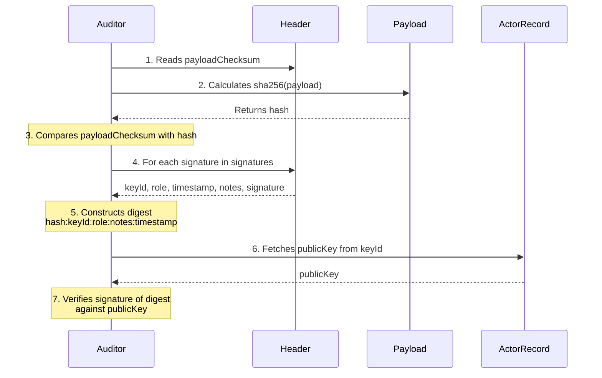

<!--
  Copyright 2025-2026 GitGovernance (https://www.gitgovernance.com)
  SPDX-License-Identifier: Apache-2.0
-->

# GitGovernance Protocol (v1.1)

> **Cryptographic governance for humans and AI agents. Open protocol. Offline-verifiable. Git-native.**

The complete, implementation-agnostic specification for the GitGovernance Protocol v1.1 — 8 RFCs and 8 JSON Schemas defining how decisions, actions, and exceptions are recorded as signed, immutable artifacts in Git.

**Status**: v1.1 Stable\
**Created**: May 2025\
**License**: Apache-2.0

---

## How It Works

Every record in the protocol follows the same pattern: domain data (payload) wrapped in a cryptographic envelope (header) that proves integrity, authorship, and intent.

```
┌─ Header ────────────────────────────────────────────────┐
│  version: "1.1"                                         │
│  type: "execution"                                      │
│  payloadChecksum: SHA-256(canonicalize(payload))        │
│  signatures:                                            │
│    ├─ keyId: "agent:vibeguard"     role: "author"       │
│    │  notes: "PCI scan completed — 12 findings"         │
│    │  signature: Ed25519(digest)                        │
│    └─ keyId: "human:security-lead" role: "reviewer"     │
│       notes: "Reviewed. 3 waivers approved."            │
│       signature: Ed25519(digest)                        │
├─ Payload ───────────────────────────────────────────────┤
│  { id, taskId, type, title, result, metadata }          │
└─────────────────────────────────────────────────────────┘
```

**Verification is three steps** (the "Three Gates"):

1. **Integrity** — Re-hash the payload. Does it match `payloadChecksum`?
2. **Schema** — Does the payload conform to the record type's JSON Schema?
3. **Authentication** — For each signature, verify Ed25519 against the signer's public key.

If all three pass, the record is authentic, untampered, and attributable. No central authority required.



---

## Core Principles

1. **Verifiability is cryptographic, not presumed.** Every record is signed. Trust is proven through Ed25519 signatures and SHA-256 checksums, not through access control or trust assumptions.

2. **Offline-verifiable by design.** Any agent receiving an instruction can independently verify its authenticity — signatures, checksums, and chain of custody — without network access. This makes the protocol resilient to prompt injection: a tampered record fails verification before execution.

3. **The Task is atomic; history lives in Executions.** A Task defines _what_ must be done. The _how_ is a sequence of ExecutionRecords linked to that task. Tasks don't grow — their execution history does.

4. **Hierarchy is for strategy (Cycles), not for work.** Cycles organize _why_ work is done (sprints, milestones, roadmaps). Tasks execute _what_ is done. This separation keeps both clean.

5. **Identity and function are separate.** Actors define _who can act_ (keys, roles). Agents define _how they work_ (engine type, capabilities). Same ID, independent evolution. A human can have multiple agent configurations; an agent can be reassigned to a different actor.

---

## The 8 RFCs

Each RFC answers one fundamental question about governance:

| RFC    | Spec                                  | Question                    | Role                                                                          |
| :----- | :------------------------------------ | :-------------------------- | :---------------------------------------------------------------------------- |
| **01** | [Embedded Metadata](./01_embedded.md) | **Is it verifiable?**       | The cryptographic envelope — signatures, checksums, Three Gates.              |
| **02** | [Actor](./02_actor.md)                | **Who did it?**             | Identity and trust — Ed25519 keys, roles, capabilities, revocation.           |
| **03** | [Agent](./03_agent.md)                | **How is it invoked?**      | The work contract — engine types (local, API, MCP), capabilities, knowledge.  |
| **04** | [Task](./04_task.md)                  | **What must be done?**      | The unit of intent — 8-state lifecycle, typed references, immutability.       |
| **05** | [Cycle](./05_cycle.md)                | **Why is it being done?**   | Strategic grouping — sprints, milestones, roadmaps, hierarchical composition. |
| **06** | [Execution](./06_execution.md)        | **How was it done?**        | The ledger of action — evidence, results, open metadata for any domain.       |
| **07** | [Feedback](./07_feedback.md)          | **What was said about it?** | The nervous system — reviews, approvals, waivers, blocking issues.            |
| **08** | [Workflow](./08_workflow.md)          | **Under what rules?**       | The constitution — named transitions, gates, the "Double Key" doctrine.       |

### Reading Order

If you're new to the protocol:

1. **[RFC-01: Embedded Metadata](./01_embedded.md)** — Understand the envelope first. Everything else lives inside it.
2. **[RFC-02: Actor](./02_actor.md)** — Understand identity. Every signature points to an actor.
3. **[RFC-04: Task](./04_task.md)** + **[RFC-06: Execution](./06_execution.md)** — The core loop: intent → evidence.
4. **[RFC-07: Feedback](./07_feedback.md)** — How decisions and exceptions are recorded.
5. **[RFC-08: Workflow](./08_workflow.md)** — How rules govern transitions.

---

## Schemas

Each RFC has a corresponding JSON Schema in [`schemas/`](./schemas/). The schemas are the **contract layer** — any SDK, CLI, or tool in any language validates records against these schemas.

| Schema                                                                     | RFC | Record Type                   |
| :------------------------------------------------------------------------- | :-- | :---------------------------- |
| [`embedded_metadata_schema.yaml`](./schemas/embedded_metadata_schema.yaml) | 01  | Envelope (`header.type` enum) |
| [`actor_record_schema.yaml`](./schemas/actor_record_schema.yaml)           | 02  | `actor`                       |
| [`agent_record_schema.yaml`](./schemas/agent_record_schema.yaml)           | 03  | `agent`                       |
| [`task_record_schema.yaml`](./schemas/task_record_schema.yaml)             | 04  | `task`                        |
| [`cycle_record_schema.yaml`](./schemas/cycle_record_schema.yaml)           | 05  | `cycle`                       |
| [`execution_record_schema.yaml`](./schemas/execution_record_schema.yaml)   | 06  | `execution`                   |
| [`feedback_record_schema.yaml`](./schemas/feedback_record_schema.yaml)     | 07  | `feedback`                    |
| [`workflow_record_schema.yaml`](./schemas/workflow_record_schema.yaml)     | 08  | `workflow`                    |

**Derivability principle**: From any RFC, you can derive exactly its schema. From any schema, you can trace back to its RFC. This coherence is enforced by automated audit.

---

## Design Decisions

### Why Named Transitions (not state machines)?

RFC-08 uses a **named transitions** model where keys are transition names (edges), not target states (nodes). Each transition has `from`, `to`, and `requires` fields. This decouples "what states exist" from "who can authorize movement between them."

### Why no dates in records?

Records don't have `createdAt`, `startDate`, or `deadline` fields. All temporal information is derived from signature timestamps. This eliminates the drift between "planned dates" and "actual dates" — timestamps always reflect reality because they come from cryptographic signatures.

### Why Git, not a database?

Git provides immutability (commits can't be silently altered), distribution (any clone is a full backup), attribution (commit history), and tooling (diff, blame, log). Adding Ed25519 signatures on top gives you a governance ledger that any auditor can verify with `git clone` and a public key — no SaaS dependency, no API access, no vendor lock-in.

---

## Protocol Versioning

The protocol uses **MAJOR.MINOR** versioning:

- **v1.x** (minor) — New RFCs, new optional fields in existing schemas, new examples, clarifications. Backwards-compatible: any implementation that validates v1.0 records will continue to work with v1.x records.
- **v2.0** (major) — Breaking changes to existing RFCs or required schema fields. Requires a migration path.

**Stability guarantee**: v1.x schemas maintain backward compatibility. Required fields, field types, and validation patterns will not change within the v1.x line. New optional fields may be added.

**Amendment process**: Changes are proposed via GitHub Issues, discussed openly, and published as GitHub Releases with a changelog describing what changed and why.

---

## Implementing the Protocol

The protocol is licensed under **Apache 2.0**. Anyone can implement it in any language without restriction.

### Reference Implementation

- **Core SDK (TypeScript)**: [`@gitgov/core`](https://www.npmjs.com/package/@gitgov/core) — MPL-2.0
- **CLI**: [`@gitgov/cli`](https://www.npmjs.com/package/@gitgov/cli) — Apache 2.0
- **MCP Server**: `@gitgov/mcp-server` — Apache 2.0

### Building Your Own

To implement the protocol:

1. Parse records as JSON files from `.gitgov/<type_plural>/<recordId>.json`
2. Validate payloads against the YAML schemas in `schemas/`
3. Implement the Three Gates: checksum verification, schema validation, signature authentication
4. Use Ed25519 for signing and SHA-256 for checksums

The schemas are your contract. If your implementation validates against them, it's compatible with every other implementation.

---

## Products Built on This Protocol

The protocol is generic by design. Products specialize it for specific domains:

- **GitGov Audit** — Security compliance. ExecutionRecords become Findings. FeedbackRecords become Waivers.
- **GitGov Triad** — Development methodology. CycleRecords become Phases. ExecutionRecords become Triad Audits.

---

## License

Copyright 2025-2026 [GitGovernance](https://www.gitgovernance.com)

Licensed under the [Apache License, Version 2.0](http://www.apache.org/licenses/LICENSE-2.0). This means you can implement, modify, and distribute this protocol for any purpose — including commercial — without restriction.
